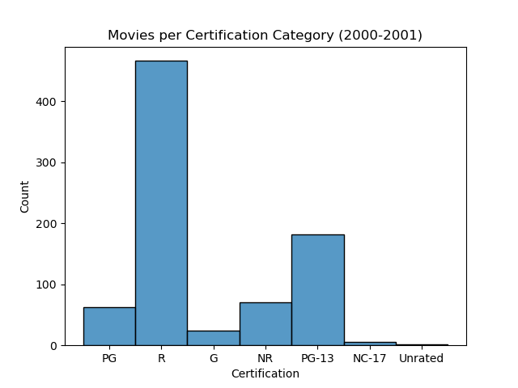
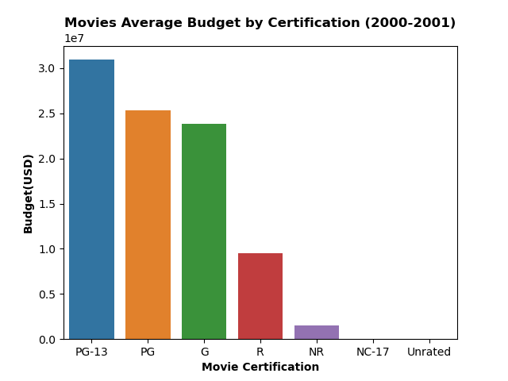

# Movies-IMBD

## Data
The data used is sourced from IMDB.

- IMDB Provides Several Files with varied information for Movies, TV Shows, Made for TV Movies, etc.
    - Overview/Data Dictionary: https://www.imdb.com/interfaces/
    - Downloads page: https://datasets.imdbws.com/

## Exploratory Data Analysis

1. How many movies had at least some valid financial information (values > 0 for budget OR revenue)?(Please exclude any movies with 0's for budget AND revenue from the remaining visualizations.)
- There are 642 movies with valid financial information.
    
    
2. How many movies are there in each of the certification categories (G/PG/PG-13/R)?
    
    
3. What is the average revenue per certification category?
   

    
    
